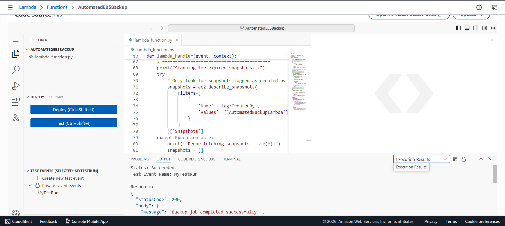
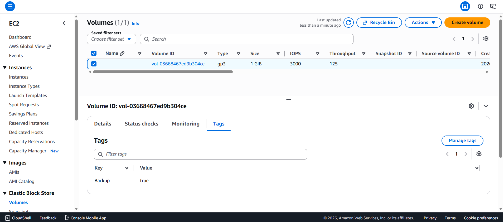
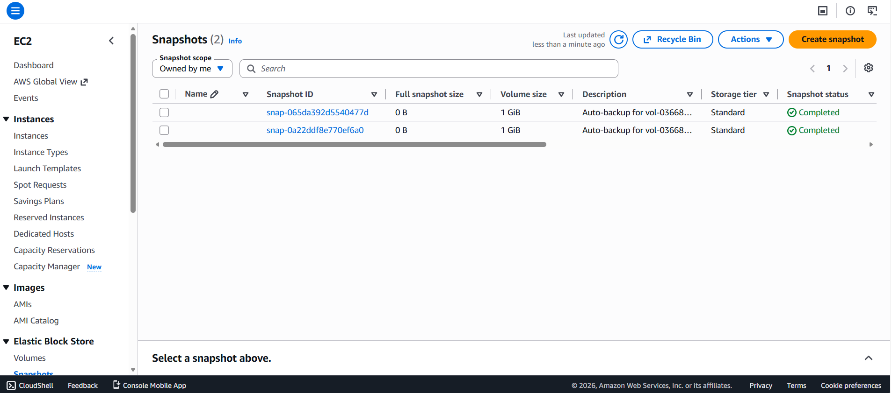

# Serverless AWS Automated EBS Backup System ☁️💾

A secure, cost-optimized, and fully serverless backup automation system built using *AWS Lambda, **Amazon EventBridge, and **Boto3 (Python)*. This system dynamically scans EC2 EBS volumes, captures snapshots of tagged resources, and automatically purges backups exceeding a 7-day retention policy to eliminate AWS storage costs.

---

## 🛠️ Tech Stack & Architecture
* *Compute:* AWS Lambda (Python, Boto3 SDK)
* *Trigger:* Amazon EventBridge (Scheduler / Cron rule)
* *Storage Interface:* Amazon EC2 EBS Snapshots
* *Security:* AWS IAM (Custom Principle of Least Privilege role)

---

## 🚀 Key Features & Engineering Decisions
* *Dynamic Resource Discovery:* Uses resource tagging (Backup: true) to target specific volumes, avoiding hardcoded IDs.
* *Storage Cost Governance:* Scans snapshot metadata dynamically and deletes backups older than 7 days, avoiding "forgotten cloud resource" billing spikes.
* *Security-First Execution:* Rather than running as an admin, the Lambda executes with a custom IAM policy restricted strictly to snapshot creation, retrieval, and targeted deletion.

---

## 📊 Proof of Concept (Visuals)

### 1. Successful Execution
Below is the execution console showing successful volume identification and snapshot creation:

### 2. Targeted Resource Tagging
Any volume with this tag is dynamically included in the daily backup cycle:

### 3. Automated Backups Created
The final generated snapshots in the EC2 console:

